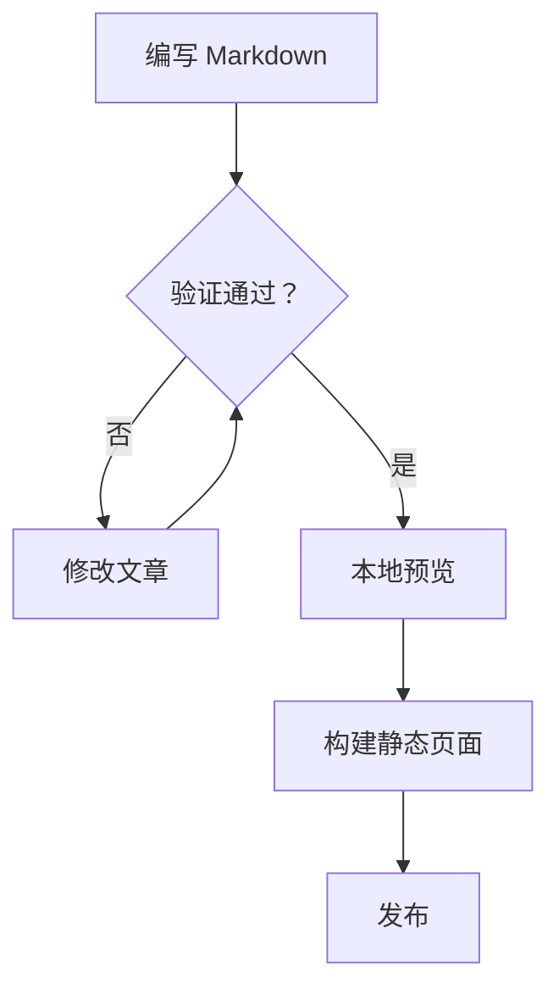

# Shirone 演示文档中文译本

本文汇集 `src/content/posts` 中 18 篇演示文章的中文内容。语法关键字、文件路径、命令、代码标识符和外部链接保留原样，以便直接照着示例使用；英文示例中的说明文字在下文译为中文。原文章均标记为 `draft: true`，生产构建不会将其列入文章页。

## 目录

1. [提示容器](#1-提示容器-admonitions)
2. [音频朗读器](#2-音频朗读器-audio-reader)
3. [折叠面板](#3-折叠面板-collapse-panels)
4. [内容批注](#4-内容批注-content-annotations)
5. [Expressive Code 代码展示](#5-expressive-code-代码展示)
6. [图片网格](#6-图片网格-image-grid-demo)
7. [缩写词](#7-缩写词-markdown-abbreviations)
8. [Shirone Markdown 扩展](#8-shirone-markdown-扩展)
9. [Markdown 扩展功能](#9-markdown-扩展功能)
10. [字段卡片](#10-字段卡片-markdown-fields)
11. [Markdown 文件引用](#11-markdown-文件引用)
12. [Mermaid 图表](#12-mermaid-图表)
13. [基础 Markdown](#13-基础-markdown)
14. [马克笔高亮](#14-马克笔高亮)
15. [选项卡组](#15-选项卡组-option-groups)
16. [剧透文本](#16-剧透文本-spoilers)
17. [步骤流程](#17-步骤流程-steps)
18. [视频嵌入](#18-视频嵌入-video)

## 1. 提示容器（admonitions）

提示容器把补充信息与正文区分开，同时保持文章的阅读节奏。各种写法都在服务端渲染，并使用同一套紧凑的 M3E 组件。

### 语义类型

- `note`：备注。例如部署背景；空格写法允许直接填写自定义标题，并兼容原有语法。
- `info`：中性的背景信息，帮助理解相邻章节。
- `tip`：建议。方括号标题写法依然可用，标题中可以使用行内 Markdown 强调。
- `important`：特别重要的提醒。GitHub Alert 写法也使用相同的渲染器，让旧文章保持一致的视觉风格。
- `warning`：警告，例如在生产构建前检查环境变量。
- `caution`：提醒不要把凭据、本地配置或私钥放进示例。

```markdown
::: note 部署背景
带空格的写法可以直接指定标题。
:::

:::info
这里填写帮助读者理解上下文的信息。
:::

:::tip[已有的 **标题** 写法]
方括号标题可以包含行内强调。
:::

> [!IMPORTANT]
> GitHub Alert 语法也会使用同一个渲染器。

:::warning
运行生产构建前，请检查环境变量。
:::

:::caution
不要公开凭据、本地配置或私钥。
:::
```

### 可选详情

`details` 使用浏览器原生的展开语义，无须客户端 JavaScript 也能通过键盘操作。默认收起；较长的代码块可以在自身区域内滚动；窄屏时容器仍限制在文章宽度内。

````markdown
::: details 查看完整命令
```powershell
npx.cmd astro check
pnpm.cmd build
```

- 初始状态为收起。
- 长代码可在代码块内滚动。
- 窄屏时不会超出正文宽度。
:::
````

## 2. 音频朗读器（audio-reader）

这组日语短音频像从动画场景边缘拾取的声音：调侃的呼唤、明亮的招呼、轻轻一笑，以及几句出处不明的话。它们是氛围样本，并非对白文字稿，适合直接聆听。音频朗读器只会在按下扬声器按钮后加载并播放对应片段。

```markdown
:audio-reader[片段标题]{src="/assets/audio/filename.wav"}
```

片段包括 **Baka**（バカ）、**Ciallo**（Ciallo！！）、**Ehe**（开玩笑的语气）、**Imoi**（イモい）和 **Zako**（雑魚じゃん、雑魚雑魚），分别对应 `/assets/audio/Baka.wav`、`Ciallo.wav`、`Ehe.wav`、`Imoi.wav` 和 `Zako.wav`。例如：

```markdown
- **Baka**: :audio-reader[バカ]{src="/assets/audio/Baka.wav"}
- **Ciallo**: :audio-reader[Ciallo！！]{src="/assets/audio/Ciallo.wav"}
- **Ehe**: :audio-reader[开玩笑的语气]{src="/assets/audio/Ehe.wav"}
- **Imoi**: :audio-reader[イモい]{src="/assets/audio/Imoi.wav"}
- **Zako**: :audio-reader[雑魚じゃん、雑魚雑魚]{src="/assets/audio/Zako.wav"}
```

`src` 必须是站点根目录路径或 HTTPS URL，指令标签不能为空。无效或不完整的指令会保留为普通 Markdown，不会加载音频朗读器资源。

## 3. 折叠面板（collapse-panels）

折叠面板把相关的可选细节收纳到紧凑的一组中。标题支持行内 Markdown，正文支持块级 Markdown；原生展开语义使每个面板在没有客户端 JavaScript 时也能使用。

### 独立面板

默认情况下，每项独立展开。标题前加 `:+` 可让该项初始展开；当分组使用 `expand` 时，加 `:-` 可让指定项保持收起。

````markdown
::: collapse
- **环境要求**

  安装依赖前，请使用 Node.js 22 或更新版本并启用 Corepack。

- :+ 安装依赖

  在仓库根目录运行：

  ```powershell
  pnpm.cmd install
  ```

- 验证命令

  构建生产站点前先检查内容处理链。

  - `pnpm.cmd check:manifest`
  - `npx.cmd astro check`
:::
````

### 手风琴模式

加入 `accordion` 后，同一时间只保留一个展开项；浏览器会直接对原生展开元素分组，无须水合。`expand` 在没有 `:+` 标记时会默认展开第一项。标题支持 **强调** 和 `代码`，正文支持完整的块级 Markdown。窄屏会缩小内边距、自动换行，代码区域可独立横向滚动。

````markdown
::: collapse accordion
- :+ 第一个标题

  第一个面板的内容。

- 含有 `代码` 的第二个标题

  第二个面板的内容。
:::
````

容器内必须恰好有一个顶层无序列表。每项都要有标题段落、空行和正文。无效或混杂的输入会作为可阅读的普通 Markdown 列表保留。

## 4. 内容批注（content-annotations）

内容批注把补充背景放在句子附近，又不打断正文。点击或激活小型注释标记即可查看内容。

### 基本语法

在正文中加入 `[+标签]` 引用，并在同一篇文章的其他位置定义对应批注。比如 Astro 预先渲染页面的大部分内容，仅在**交互岛**需要交互时对其进行水合：

```markdown
Astro 会预先渲染页面的大部分内容，仅在**交互岛** [+islands] 需要交互时才水合。

[+islands]:
  交互岛是被静态 HTML 包围的交互式界面组件。页面默认保持轻量，同时保留必要的交互。
```

### 丰富内容与多个定义

批注定义可以包含段落、强调、链接、列表和 `行内代码`。写作时让第一句能独立说明要点；需要原始资料时提供链接；示例宜简短，例如 `client:visible`。完整模型见 [Astro Islands 文档](https://docs.astro.build/en/concepts/islands/)。

同一标签可以定义多次，借一个标记呈现一组相关说明。例如 `[+review]` 可依次提示：先写会改变读者下一步行动的决定；将实现证据与背景分开；把属于正文的细节移回正文。未定义的 `[+missing]` 仍是普通文字，不会出现空按钮。

## 5. Expressive Code 代码展示

这一篇展示 [Expressive Code](https://expressive-code.com/) 如何呈现 Markdown 代码块。示例依据官方文档，细节可在所链接的功能文档中查阅。代码中的字符串和标识符保留原样，方便直接复制和验证。

### 语法高亮

普通代码围栏会按语言高亮，例如 ` ```js ` 中的 `console.log('This code is syntax highlighted!')`。`ansi` 围栏可展示 ANSI 转义序列，包括普通色、粗体色、暗色、256 色（示例使用 160 至 177）、完整 RGB 色，以及粗体、暗色、斜体和下划线。详见[语法高亮文档](https://expressive-code.com/key-features/syntax-highlighting/)。

### 编辑器与终端边框

代码围栏可以用 `title="my-test-file.js"` 显示文件名，也可从代码首行的文件名注释推断标题。`bash`、`powershell` 等语言会显示终端外观，终端同样可设置标题。`frame="none"` 可取消边框，`frame="code"` 可强制将 PowerShell 等终端语言按编辑器窗口展示。详见[边框文档](https://expressive-code.com/key-features/frames/)。

````markdown
```js title="my-test-file.js"
console.log('Title attribute example')
```

```sh frame="none"
echo "Look ma, no frame!"
```

```ps frame="code" title="PowerShell Profile.ps1"
function Watch-Tail { Get-Content -Tail 20 -Wait $args }
New-Alias tail Watch-Tail
```
````

### 文本和行标记

使用 `{1, 4, 7-8}` 可以标记指定行号或区间。`del={2}` 标记删除行，`ins={3-4}` 标记新增行，单独的 `{6}` 使用中性的默认标记。还能给标记加短标签，例如 `{"1":5}`，或加较长的说明标签，例如 `{"1. Provide the value prop here:":5-6}`；标签中的英文分别表示“在这里提供 value 属性”“移除 disabled 和 active 状态”“在按钮内渲染子元素”。

```js title="line-markers.js" del={2} ins={3-4} {6}
function demo() {
  console.log('this line is marked as deleted')
  // 这一行和下一行标记为新增
  console.log('this is the second inserted line')

  return 'this line uses the neutral default marker type'
}
```

`diff` 围栏把 `+` 开头的行标为新增、`-` 开头的行标为删除；真正的 diff 文件内容（如 `--- a/README.md`、`+++ b/README.md` 和 `@@ ... @@`）会保留原样。用 ` ```diff lang="js" ` 可在差异标记之外继续高亮 JavaScript。详见[文本标记文档](https://expressive-code.com/key-features/text-markers/)。

行内文本可通过 `"given text"` 精确标记，同一行多个匹配都会生效。`/ye[sp]/` 用正则同时匹配 `yes` 和 `yep`；路径中的斜杠需转义，例如 `/\/ho.*\//`。`ins="inserted"`、`del="deleted"` 可以给行内文本指定新增或删除状态，未指定类型的字符串使用默认标记。

### 自动换行

`wrap` 为单个代码块打开自动换行，`wrap=false` 关闭。`preserveIndent` 默认保留长行换行后的缩进；`preserveIndent=false` 取消这种缩进。短示例：

````markdown
```js wrap preserveIndent=false
function getLongString() {
  return 'This is a very long string that may not fit in a narrow container'
}
```
````

详见[自动换行文档](https://expressive-code.com/key-features/word-wrap/)。

### 可折叠代码段与行号

`collapse={1-5, 12-14, 21-24}` 可让多段样板代码初始收起，重要的调用逻辑保持可见。原示例依次收起导入与初始化、计算函数中的变量准备，以及末尾关闭连接和释放内存的清理步骤。详见[可折叠代码段文档](https://expressive-code.com/plugins/collapsible-sections/)。

`showLineNumbers` 为代码块显示行号，`showLineNumbers=false` 关闭；`startLineNumber=5` 从第 5 行开始计数。详见[行号文档](https://expressive-code.com/plugins/line-numbers/)。

## 6. 图片网格（image-grid-demo）

`:::grid` 是博客的图片画廊容器。它把普通 Markdown 图片排列成响应式网格，统一每张卡片的宽高比，并自动提供灯箱查看功能。适用于文章插图、截图、作品集和小型相册。同一画廊的图片使用相同卡片比例；默认从中心裁剪，使每一行整齐。点击图片可在灯箱中查看完整原图。每个网格有自己的灯箱分组，不会与文章中的其他图片混在一起。

这篇原文同时是功能说明和视觉测试页：可以在桌面、平板、手机宽度下观察布局，再点击图片检查灯箱分组。

### 最简写法与参数

在 `:::grid` 和结尾的 `:::` 之间直接写 Markdown 图片。每张图片单独成段，图片之间留空行；段落、列表和代码块放在容器外。无参数时使用 3 列、`16/10` 比例和 `cover` 裁剪。

````markdown
:::grid


:::
````

参数放在开头指令的花括号中，例如 `:::grid{columns="3" aspect="16/9" fit="cover"}`。

| 参数 | 可用值 | 默认值 | 含义 |
| --- | --- | --- | --- |
| `columns` | `1` 至 `6` 的整数 | `3` | 桌面端每行列数；无效值回退到 `3`。 |
| `aspect` | 正数比例，如 `16/9`、`3/4`、`1/1` | `16/10` | 卡片显示比例，与原图比例无关。 |
| `fit` | `cover`、`contain` | `cover` | `cover` 裁剪并铺满；`contain` 保留整图，可能留下空白。 |

````markdown
:::grid{columns="3" aspect="16/9" fit="cover"}


:::
````

原文的最简示例使用 `landscape-1.webp` 和 `landscape-2.webp`；参数示例使用 `landscape-1.webp` 至 `landscape-3.webp`，展示 3 列横图和显式标题如何优先作为说明文字。

### 说明文字、替代文本与裁剪

图片的替代文本既提供无障碍描述，也充当默认说明文字。可选的图片标题存在时，标题优先显示在图片下方：

```markdown

```

同一行的说明文字都与卡片底部对齐；较长的文字换行时，其他说明不会上浮。`3:4`、`16:9` 一类比例可以直接写在正文、标题和替代文本中，无须转义。原文用 `square-1.webp` 至 `square-3.webp` 对比了替代文本、显式标题和较长说明的底部对齐效果。

桌面端按 `columns` 指定的列数排列；低于 `768px` 时最多两列，低于 `480px` 时一列。卡片保持 `aspect` 指定的比例并裁切圆角，图片填满卡片，且不带主题普通图片的默认外边距。

- `cover` 是推荐默认值：从中心裁剪以铺满卡片，画廊看起来更统一。
- `contain` 完整展示原图，不裁剪；如果图片与卡片比例不同，会露出主题背景，适合不能被裁剪的图片。
- 如果想同时展示完整图片且减少空白，可以把 `aspect` 设为接近原图比例，或让图片单独成一个网格。

原文把同一组三张竖图 `default-portrait-1.webp` 至 `default-portrait-3.webp` 分别放进 `16/9` 的 `cover` 与 `contain` 卡片：前者裁剪，后者保留完整图像并留下背景区域。

### 全部布局示例

以下逐项对应原文的示例图片及其测试目标，图片路径都相对于原文所在的 `src/content/posts/image-grid-demo/` 目录。

| 示例 | 指令参数 | 示例图片 | 观察点 |
| --- | --- | --- | --- |
| 默认配置 | `:::grid` | `default-portrait-1.webp` 至 `-3.webp` | 3 列、`16/10`、`cover`，验证默认裁剪与说明文字。 |
| 三列竖图 | `columns="3" aspect="3/4"` | `default-portrait-1.webp` 至 `-3.webp` | 竖向卡片比例统一；原图比例不同则从中心裁剪边缘。 |
| 三列横图 | `columns="3" aspect="16/9"` | `feature-landscape-1.webp` 至 `-3.webp` | 常见视频封面比例；接近卡片比例时裁剪很少。 |
| 两列方图 | `columns="2" aspect="1/1"` | `mixed-square-1.webp` 至 `-3.webp` | 第三张换到下一行，末行保持网格列宽，不拉伸。 |
| 四列完整图 | `columns="4" aspect="16/9" fit="contain"` | `default-portrait-1.webp` 至 `-3.webp` | 竖图完整可见，背景留白属于预期；不同灯箱组互不影响。 |
| 单列细节图 | `columns="1" aspect="16/9"` | `feature-landscape-1.webp` | 各屏幕宽度都保持单列，可在灯箱看原图。 |
| 五列稀疏行 | `columns="5" aspect="1/1"` | `mixed-square-1.webp` 至 `-3.webp` | 只有三张时靠左排列，不把图片拉宽。 |
| 六列混合图 | `columns="6" aspect="1/1"` | 三张 `default-portrait` 和三张 `feature-landscape` | 验证最大列数、混合比例的裁剪及窄卡片说明；正文通常以 2 至 4 列更易阅读。 |
| 四列方图 | `columns="4" aspect="1/1"` | `square-1.webp` 至 `-4.webp` | 桌面四张一行，平板两列，手机一列。 |
| 六列横图 | `columns="6" aspect="16/9"` | `landscape-1.webp` 至 `-6.webp` | 适合缩略图、作品集及截图索引，`cover` 统一填满卡片。 |
| 六张竖图 | `columns="3" aspect="3/4"` | `portrait-1.webp` 至 `-6.webp` | 两行三列，适合人物、海报、手机截图；说明文字底部对齐。 |
| 边缘有重要内容 | `columns="3" aspect="16/9" fit="cover"` | `critical-1.webp` 至 `-3.webp` | 卡片可能裁掉边缘，灯箱展示未裁剪原图；宜写清楚说明。 |
| 极端比例 | `columns="3" aspect="16/9" fit="contain"` | `extreme-1.webp` 至 `-3.webp` | 横幅、长截图等保持完整，可能出现主题背景空白。 |
| 透明图片 | `columns="1" aspect="16/9" fit="contain"` | `transparent-1.webp` | 透明区域露出卡片背景，便于检查原图边缘和灯箱行为。 |

### 灯箱导航与检查清单

点击网格中的图片会打开 Fancybox 灯箱，可缩放、旋转、全屏、查看缩略图，并用方向键切换。导航范围只限当前 `:::grid`：例如打开“三列横图”的第一张，仅能切换到该组另外两张。文章中的普通 Markdown 图片单独处理，不加入网格灯箱。

检查时确认：每组图片尺寸一致、说明文字位于卡片下方；悬停时图片轻微放大；点击后可以缩放、旋转和键盘导航；`768px` 以下至多两列，`480px` 以下一列；`contain` 中的竖图完整可见；五列和六列在宽屏保持设置的列数，随后按响应式规则收缩。

## 7. 缩写词（markdown-abbreviations）

缩写词能使技术文章保持简洁，同时让需要解释的读者随时查看完整名称。已定义的术语会渲染为原生 `<abbr>` 元素，含义在悬停时及辅助技术中可用。

例如，SSR 优先的输出让初始文档在 JavaScript 运行前就可见。衡量阅读体验时，LCP 和 CLS 可反映首屏内容是否加载迅速、显示稳定。缩写也可以与普通 Markdown（如 **SSR** 指南）相邻，但行内代码 `` `SSR` `` 和[文档链接中的 LCP](https://web.dev/articles/lcp) 不会被改写。

定义可以放在同一篇 Markdown 文档的任何位置；定义行本身不显示为段落，只影响当前文章中匹配的词。

```markdown
*[SSR]: Server-Side Rendering（服务端渲染）
*[LCP]: Largest Contentful Paint（最大内容绘制）
*[CLS]: Cumulative Layout Shift（累积布局偏移）

SSR 让 HTML 响应在客户端代码运行前就可用。
```

术语必须以字母或数字开头，可包含字母、数字、句点、下划线、加号和连字符。每个定义仅对当前文章生效；无效或重复的定义保留为普通 Markdown，不会悄悄覆盖已有定义。

## 8. Shirone Markdown 扩展

Shirone 提供主题专属的 Markdown 扩展和自定义语法容器。它们基于 unified 的 AST 处理链，在站点构建时生成可访问的语义 HTML；无需额外的客户端 JavaScript 水合，并与 M3E 设计令牌一致。

### 文件树

文件树把多层项目目录、源代码层级和终端目录输出变成紧凑的交互视图，支持按扩展名显示图标、突出差异和折叠分支。

用 `:::file-tree` 容器直接写嵌套 Markdown 列表：

````markdown
:::file-tree{title="Shirone 源码树"}
- src
  - components/
    - ++ Navigation.svelte # 新增组件
    - -- Button.astro # 移除的组件
  - content
    - posts/
      - markdown-enhancements.md
  - layouts/
    - PostLayout.astro
  - plugins
    - markdown/
      - rehype-file-tree.mjs
  - styles
    - markdown/
      - trees.css
  - **content.config.ts** # 重要文件
- public/
  - favicon.svg
- package.json
:::
````

写作规则：项目前缀 `++` 显示绿色背景和新增标记，`--` 显示红色背景和删除线；`#` 后的文字是靠右显示的淡色行内注释；用 `**粗体**` 突出重要文件。根据嵌套列表识别的目录默认展开；目录名末尾加 `/`（如 `components/`）则初始收起，读者可以点击或用键盘展开。

已有 `tree` 等命令输出时，可直接粘贴到 `file-tree` 代码围栏。Unicode 树枝字符（`├──`、`└──`、`│`）和 ASCII 树枝字符都能解析。

````markdown
```file-tree title="构建输出" icon="simple"
dist
├── _astro/
│   ├── index.css
│   └── page.js
└── favicon.ico
```
````

`title="..."` 设置标题和无障碍名称；`icon="colored"` 使用默认彩色扩展名图标，`icon="simple"` 使用简洁的单色图标。

### 代码树

代码树左侧是多级文件导航，右侧是可即时切换的代码面板，适合多文件示例、模块和目录讲解，阅读体验类似 IDE。

在 `:::code-tree` 内放多个代码围栏，每个围栏通过 `title="路径"` 指明文件：

````markdown
:::code-tree{title="Shirone 组件示例" height="380px" entry="src/Button.svelte"}
```svelte title="src/Button.svelte"
<script lang="ts">
  let { label = "点我" } = $props();
</script>

<button class="m3-btn">{label}</button>
```

```stylus title="src/styles/button.styl"
.m3-btn
  background: var(--primary)
  color: var(--on-primary)
  border-radius: var(--shape-corner-m)
```

```json title="package.json"
{
  "name": "button-demo",
  "version": "1.0.0"
}
```
:::
````

容器的 `title` 设置标题和无障碍名称；`height` 指定桌面高度，默认 `420px`，也可以写 `380px`、`26rem`；`entry` 指定初次打开的文件；`icon` 在彩色和单色图标之间切换。还可以给某个代码围栏加 `:active`，将它设为默认选中项。

已有本地目录时，可用 `@[code-tree]` 在构建时自动扫描并生成代码树，不必手工复制每个文件。原文展示了 `/src/utils/anime` 和 `/src/config` 两种目录用法：

```markdown
@[code-tree title="动画工具" entry="status.ts"](/src/utils/anime)
@[code-tree title="站点配置" entry="siteConfig.ts"](/src/config)
```

## 9. Markdown 扩展功能

### GitHub 仓库卡片

可添加链接到 GitHub 仓库的动态卡片。页面加载后会从 GitHub API 获取仓库信息。语法为 `::github{repo="<owner>/<repo>"}`，例如：

```markdown
::github{repo="Fabrizz/MMM-OnSpotify"}
::github{repo="saicaca/fuwari"}
```

### Mermaid 图表

`mermaid` 代码围栏会渲染成图表，并跟随当前配色方案。原示例依次表示“Markdown 源文件 → Astro 内容处理链 → 语义 HTML → 主题化图表”。

````markdown

````

### 提示容器与剧透

支持 `note`、`tip`、`important`、`warning`、`caution` 五种提示类型，分别用于一般信息、可选建议、关键要求、需要立即注意的风险，以及可能造成负面后果的操作。基本写法：

```markdown
:::note
即使快速浏览也应注意的信息。
:::

:::tip
帮助读者更顺利完成操作的可选建议。
:::
```

方括号可自定义标题，例如 `:::note[我的自定义标题]`。GitHub 的 `> [!NOTE]`、`> [!TIP]` 语法同样支持。行内剧透写为 `:spoiler[隐藏的 **内容**]`，其中也可以使用 Markdown 强调。

### 图片宽度与说明文字

独立图片的替代文本中可选用 `w-N%` 指定宽度；Markdown 图片标题会作为居中说明显示在图片下方。

```markdown

```

有效宽度为 `w-1%` 至 `w-100%`；无效的宽度词仍留在替代文本中。宽度和说明文字相互独立：仅设置标题也能显示说明。原文分别展示了带 `w-50%` 和说明文字的图片、只带 `w-75%` 的图片，以及没有宽度词但带说明文字的图片。

## 10. 字段卡片（markdown-fields）

当同一 API 或组件有多个相关选项时，用 `field-group` 展示字段卡片。在字段容器的起始行写字段名，然后在说明文字前写元数据标签。

````markdown
:::: field-group
::: field tex
@type object
@optional

TeX 解析器选项。
:::

::: field output
@type `'svg' | 'chtml'`
@default `'svg'`
@optional

输出格式，可选 SVG 或通用 HTML。
:::
::::
````

### 基本字段

同一组里可以混用必填、可选、已弃用状态。默认值与类型分开显示，方便快速浏览。原示例中的 `title` 是必填字符串，作为页面标题显示，应足够简短；`disabled` 是可选布尔值，默认 `false`，表示控件初始是否禁用；`locale` 是可选的 `'en' | 'zh-CN' | 'ja-JP'`，默认 `'en'`，用于格式化日期、数字和无障碍标签。

### 丰富描述

字段说明是普通 Markdown，支持链接、强调、列表和行内代码。`render` 为必填的 `(value: unknown) => string` 回调：将值转换为最终输出，应返回**安全的字符串**，可以使用 `formatValue`；渲染结果要确定，回调内部避免网络请求。`retries` 是可选数字，默认 `3`，表示报告请求失败前最多重试几次。`legacyMode` 是已弃用的布尔值，保留它只为向后兼容；新集成应改用 `compatibility`。

单个字段也可以脱离分组使用。原文的 `format` 字段类型为 `'short' | 'long'`，默认 `'short'`，用于控制结果格式。

`@type` 与 `@default` 的值按代码样式呈现；`@required`、`@optional`、`@deprecated` 增加状态徽章；元数据后面的普通 Markdown 成为字段描述；未知的 `@标签` 会保留在说明文字中，不会被丢弃。

## 11. Markdown 文件引用

Shirone 可在构建时引用本地 Markdown 文件，也可安全地只引用文件的一部分。原文通过 `#public-api` 片段引用了 `src/content/snippets/include-example.md`。还支持整文件、指定行区间、从指定行到末尾、从开头到指定行：

```markdown
<!-- @include: src/content/snippets/include-example.md#public-api -->
<!-- @include: src/content/snippets/include-example.md -->
<!-- @include: src/content/snippets/include-example.md{1-4} -->
<!-- @include: src/content/snippets/include-example.md{5-} -->
<!-- @include: src/content/snippets/include-example.md{-4} -->
```

代码围栏中的引用注释只作为字面文本显示，不会执行引用。

## 12. Mermaid 图表

Mermaid 可以把 Markdown 中的文字描述转成图表。原文使用 Shirone 的内容处理流程，展示技术文章和项目笔记中常用的图表类型。每种示例都放在标准的 `mermaid` 代码围栏中：服务端保留可读的源代码，浏览器再增强为跟随当前主题的 SVG。切换主题或通过 Swup 导航到文章时，图表会重新渲染。

### 流程图（`flowchart TD`）

流程图描述过程、判断分支和回到先前步骤的路径。示例的文章发布流程是：编写 Markdown → 验证；失败则修改并重新验证，成功则本地预览 → 构建静态页面 → 发布。

````markdown

````

### 时序图（`sequenceDiagram`）

时序图按时间顺序展示参与方的协作。示例中，读者打开另一篇文章，浏览器启动 Swup 站内导航，Swup 替换文章区域并发出 `content:replace`，Mermaid 渲染器查找新页面中的图表容器，最后插入跟随主题的 SVG。参与方包括读者、浏览器、Swup、文章区域和渲染器。

### 实体关系图（`erDiagram`）

实体关系图描述结构化数据及其关联。原示例中，作者撰写文章，文章收到评论，`POST_TAG` 关联记录使一篇文章能对应多个标签。实体字段包括：`AUTHOR` 的主键 `id` 与 `display_name`；`POST` 的 `slug`、`title`、`published_at`、外键 `author_id`；`COMMENT` 的 `id`、文章外键和正文；`TAG` 的 `id` 与 `label`；`POST_TAG` 的文章和标签外键。

### 类图（`classDiagram`）

类图说明软件设计中的职责、公开方法和依赖方向。示例有四个模块：`ContentPipeline` 渲染 Markdown 并收集元数据；`MermaidPlugin` 转换代码围栏并建立降级内容；`DiagramRenderer` 初始化、渲染所有图表、刷新主题；`ThemeTokens` 提供主色、表面色和轮廓色。内容管线使用 Mermaid 插件，客户端渲染器增强插件输出并读取主题令牌。

### 状态图（`stateDiagram-v2`）

状态图展示对象的生命周期和状态转换。文章从草稿进入审核，审核可要求修改并返回草稿，也可批准发布；已发布文章可撤回为草稿，或归档结束。

### XY 图（`xychart-beta`）

XY 图把柱形和折线放在同一坐标轴上，用于比较数值与趋势。原示例横轴是第 1 至 6 周，纵轴是 0 至 100 的相对分数；柱形数据为 `36、52、44、68、76、84`，表示归一化的每周发布量；折线数据为 `48、55、62、61、73、81`，表示归一化的阅读完成度。

### 饼图（`pie showData`）

饼图简洁地比较各类别在整体中的占比。文章主题示例：工程 `40%`、设计系统 `25%`、指南 `20%`、随笔 `15%`。

### 甘特图（`gantt`）

甘特图按日历时间排列任务、依赖和里程碑。主题发布计划使用 `YYYY-MM-DD` 日期格式、`%m/%d` 坐标轴格式。设计阶段从 2024-05-06 起用两天确认需求，随后用三天细化交互；实现阶段开发组件六天，并行编写示例四天；验证阶段在组件完成后自动测试三天，最后以发布作为零时长里程碑。

### 思维导图（`mindmap`）

思维导图从中心主题扩展到相关领域。以 Shirone 为中心，原示例分为内容体验（Markdown、搜索、图表）、界面系统（M3E 令牌、响应式布局、配色方案）和工程质量（Astro 检查、Playwright、无障碍）。

### 时间线（`timeline`）

时间线概括事件或阶段，不要求精确的持续日期。Mermaid 支持能力的演进分为：内容管线设计（识别 Mermaid 代码围栏、保留源代码降级显示）；客户端增强（按需加载运行时、应用主题令牌）；可靠性（支持 Swup 导航、验证响应式与无障碍输出）。

### 用户旅程图（`journey`）

用户旅程图结合任务阶段、参与者与体验评分。读者的技术文章阅读过程分为：发现阶段，浏览文章列表评分 4、选择主题评分 5；理解阶段，阅读文章评分 4、查看关系图评分 5；继续阶段，打开相关文章评分 4、收藏页面评分 3。

### Git 图（`gitGraph`）

Git 图展示功能分支如何在合并主线前推进。示例从 `base` 提交创建 `mermaid` 分支，依次提交 `add-renderer` 和 `add-tests`，切回 `main` 合并为 `merge-mermaid`，最后提交 `release`。

### 看板（`kanban`）

看板按工作状态分组，便于快速查看进度。原示例的待办包括编写作者文档和扩展示例数据；进行中是验证主题适配；已完成的是源代码降级显示与客户端渲染。

### 桑基图（`sankey-beta`）

桑基图用连接线宽度显示流量或其他数量在节点之间的流动。原示例有落地页到阅读 `720`、发现到阅读 `430`、阅读到探索 `360`、阅读到主题页 `210`、阅读到外部页面 `140` 五条流。

## 13. 基础 Markdown

这篇原文用一篇简单文章展示 Markdown 和部分 Pandoc 写法。一级标题后以空行分隔段落；段落中可使用 *斜体*、**粗体**和 `等宽代码`。无序列表、引用块可以包含多项或多个段落；有序列表可嵌套无序列表和缩进代码。后续文字通常与列表内容按四个空格对齐。

````markdown
# 一级标题

段落之间用空行分隔。第二段有 *斜体*、**粗体** 和 `等宽代码`。

- 第一项
- 第二项
- 第三项

> 引用块可以这样写，
> 也可以在其中加入多个段落。

## 二级标题

1. 第一项
2. 第二项
3. 第三项
````

原文演示了四空格缩进的代码块，以及更便于复制的围栏代码块；围栏还可以指定 `python` 等语言以启用语法高亮。三级标题之后展示嵌套列表：先准备胡萝卜、芹菜和扁豆，再烧水，将食材放进锅里，按“找木勺、揭锅盖、搅拌、盖锅盖、放好木勺、等十分钟、回到第一步或关火”的步骤操作，并提醒不要碰掉木勺。

链接可以指向外部网站、本地文档或当前文档的章节锚点；脚注使用 `[^1]` 引用并在后文定义。原文还展示了鞋码、材料、颜色组成的表格、带标题的表格，以及可跨行的表格。分隔线可用 `---`；定义列表示例解释了苹果可做苹果酱、橙子属于柑橘类，番茄单词的拼写；行块用每行开头的 `|` 表示。

图片语法为 ``；原文中的图片示例被放在注释里，不会显示。行内数学公式使用 `$\omega = d\phi / dt$`；独占一行的公式使用双美元符号，例如 `$$I = \int \rho R^{2} dV$$`，还给出了较长的圆周率公式。要让标点作为普通文字显示，可以反斜杠转义，如 `\`foo\``、`\*bar\*`。示例还提到了 `---`、`--` 和 `...` 在 Pandoc 中分别可表示破折号、范围连接和省略号，并展示了 Unicode 字符。

## 14. 马克笔高亮

马克笔高亮强调段落中的特定短语，不必把整段放进独立组件。构建时会生成原生 `<mark>` 元素，并继承当前 M3E 配色。

`==文字==` 使用主题主色。例如：“读者应记住的 ==一个关键决定==”；高亮片段里也可以包含 ==嵌套的 **Markdown 强调**==。若语义需要不同色调，可在后面加后缀：`primary`、`secondary`、`tertiary`、`error`、`tip`，分别用于主题关联、低调的补充区别、另一种编辑提示、待纠正的条件和实用建议。

```markdown
==主色高亮==
==次级高亮=={.secondary}
==第三色高亮=={.tertiary}
==需要修正的条件=={.error}
==实用建议=={.tip}
```

行内代码中的 `` `==字面语法==` `` 和代码围栏里的示例保持字面内容，便于文档讲解语法而不触发它。

## 15. 选项卡组（option-groups）

选项卡组把等价的说明放在一起，避免重复写周围的解释。每个选项都支持完整的块级 Markdown；同一页面中，选中的值还可以与另一个分组同步。

### 选择包管理器

`@tab:active` 指定初始选项。标题后的 `#` 后缀提供稳定的值，不改变显示的标题。下面的示例用 `package-manager` 作为分组 ID，初始选择 pnpm；三个选项分别展示 npm、pnpm 和 Bun 的安装命令。

````markdown
::: tabs#package-manager

@tab npm

使用 npm 安装：

```powershell
npm install astro
```

@tab:active **pnpm**#pnpm

使用 pnpm 安装：

```powershell
pnpm.cmd add astro
```

@tab Bun#bun

使用 Bun 安装：

```powershell
bun add astro
```

:::
````

### 运行项目与更多选项

另一组同样使用 `tabs#package-manager`，因此选中上面的包管理器后，下方会同步显示相应的 `npm run dev`、`pnpm.cmd dev` 或 `bun run dev`，并在下次访问时记住该选择。

选项更多时，标题行仍保持单行，在窄屏的导航区域内横向滚动。原文的五个选项依次是本地工作站（开发功能时使用本地工具链）、托管预览环境（发布临时预览供审阅）、持续集成（对每次变更运行确定性验证）、生产部署（将验证过的产物推进生产环境）、离线恢复流程（断网时从本地产物恢复）。

每个分组至少需要两个 `@tab` 区段。标记行与正文之间必须有空行，每个区段都要有内容。无效或不完整的分组仍保持为可阅读的普通 Markdown。

## 16. 剧透文本（spoilers）

剧透语法可以遮住简短答案或剧情细节，但内容仍留在文档里。读者悬停、聚焦或激活原生控件即可查看。例如“答案是 :spoiler[**42**]”，周围仍是普通 Markdown；剧透中还可以放 `行内代码` 或更长的 **强调文字**。

```markdown
答案是 :spoiler[42]。
```

生成的 HTML 使用带 `aria-expanded` 状态的原生按钮。即使没有 JavaScript，悬停和聚焦仍能显示文字；可选的运行时代码另外提供点击及键盘切换。

## 17. 步骤流程（steps）

操作顺序重要时使用 Steps。组件以低干扰的编号轨道提示进度，同时保留标题、段落、链接、列表和代码原有的 Markdown 语义，不打断正文阅读。

在 `:::steps` 容器内包裹一个 Markdown 有序列表，每个顶层列表项就是一步：

````markdown
:::steps[生产部署]
1. **克隆并准备工作区**

   克隆仓库并进入项目目录。

   ```powershell
   git clone https://github.com/LyraVoid/Shirone.git
   Set-Location Shirone
   ```

2. **安装依赖**

   使用仓库固定的包管理器。

   ```powershell
   pnpm.cmd install
   ```

3. **运行项目检查**

   确认 Astro 诊断和 TypeScript 检查通过。

   ```powershell
   npx.cmd astro check
   pnpm.cmd type-check
   ```

4. **构建生产站点**

   生成静态站点和搜索索引。

   ```powershell
   pnpm.cmd build
   ```
:::
````

`:::steps[标题]` 或 `title="标题"` 会加入可见标题与无障碍名称；`start=4` 可使显示编号从 4 开始。容器中必须恰好有一个有序列表；无效或混杂的内容仍作为普通、可阅读的 Markdown 呈现，不做猜测式解析。渲染在构建时完成，不增加客户端 JavaScript 或网络请求。

## 18. 视频嵌入（video）

可以从 YouTube 或其他平台复制嵌入代码并粘贴到 Markdown 文件中。例如原文演示了带 `width="100%"`、`height="468"`、`src`、`title` 和 `allowfullscreen` 的 `<iframe>`。也可以使用 Shirone 的媒体指令：

```markdown
::youtube{id="5gIf0_xpFPI" title="YouTube 视频" preload="auto"}

::bilibili{bvid="BV1fK4y1s7Qf" title="哔哩哔哩视频" p=1 preload="auto"}

::acfun{acid="ac48649632" title="AcFun 视频" preload="auto"}

::artplayer{src="https://www.pexels.com/download/video/38538991/" title="Sintel 预告片" preload="auto"}
```

原文依次展示了 YouTube、哔哩哔哩、AcFun 和 ArtPlayer。站点文章实际使用时，应按需要填写各平台的视频 ID、地址与标题。
